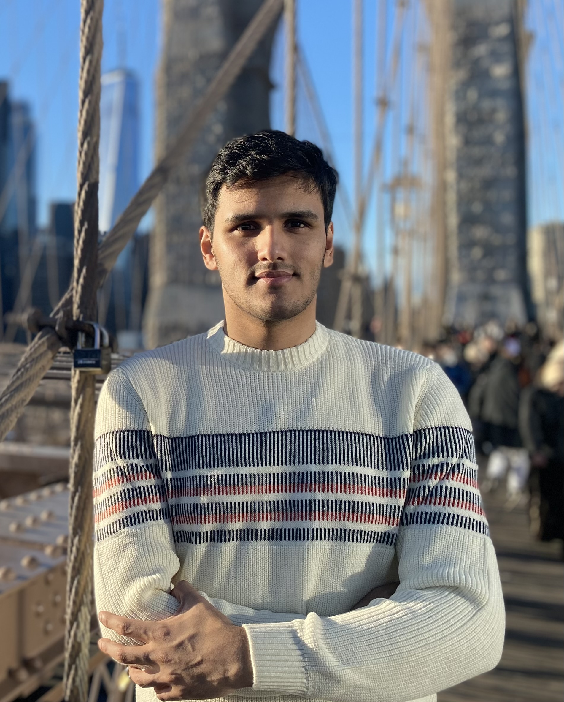

<!-- Image section -->

<!-- Main content -->

  Hello! I am a PhD candidate in the Program in Atmospheric and Oceanic Sciences at Princeton University, advised by Dr. Rong Zhang. My primary research interests are the ocean’s role in climate, air-sea interactions, global teleconnections, Indian monsoon, and extreme events.

  I am always curious to work on problems that increase our understanding of global and regional climate. Currently, using fully coupled high-resolution climate models, my research focuses on comprehending the remote impacts of the North Atlantic ocean circulation changes.

